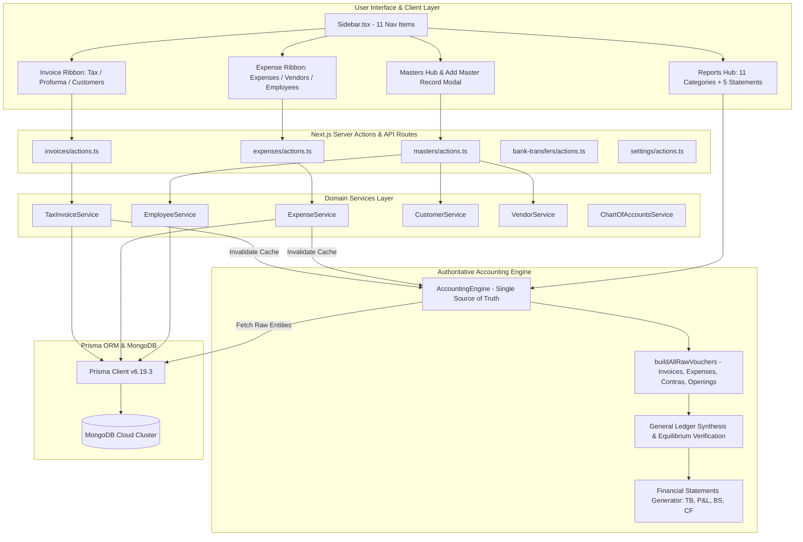

# FINLEDGER — SYSTEM ARCHITECTURE OVERVIEW & CODEBASE AUDIT
**Organization:** KVJ Analytics  
**Application:** FinLedger ERP  
**Document Type:** Technical & Architectural Inspection Report (Phase 1 Deliverable)  
**Version:** 1.0.0  
**Inspection Date:** 09-Oct-2026

---

## 1. Technical Stack Summary

| Dimension | Technology / Tool | Version / Spec | Notes |
| :--- | :--- | :--- | :--- |
| **Framework** | Next.js (App Router) | `16.2.11` | Turbopack enabled, Server Components + Client Components |
| **Runtime / Language** | Node.js / TypeScript | Node v20+, TS `5.x` | Strict typechecking enabled (`tsconfig.json`) |
| **UI Library** | React / React DOM | `19.2.4` | Modern React Hooks, transitions, concurrent mode |
| **Styling** | Tailwind CSS / PostCSS | `@tailwindcss/postcss` v4 | Design system tokens, emerald/teal accounting themes |
| **Database** | MongoDB | Document Store | Scalable cloud cluster via connection string |
| **ORM / Data Access** | Prisma Client | `6.19.3` | Schema located at `prisma/schema.prisma` |
| **Authentication** | NextAuth.js | `5.0.0-beta.32` | Credentials provider, JWT sessions, bcryptjs password hashing |
| **Visualization** | Recharts | `3.10.0` | Executive and analysis charts |
| **Data Export** | SheetJS (`xlsx`) | `0.18.5` | Excel ledger, statement, and report exports |

---

## 2. Directory Structure & Layered Architecture

```
Billing ERP System/
├── app/                                 # Next.js App Router (Routes & Server Components)
│   ├── (dashboard)/                     # Authenticated ERP workspace routes
│   │   ├── dashboard/                   # Executive summary & quick actions
│   │   ├── ledgers/                     # Account-level ledger statements
│   │   ├── journals/                    # Day book & journal vouchers
│   │   ├── invoices/                    # Tax invoices (confirmed sales)
│   │   ├── proforma-invoices/           # Commercial quotes (zero GL effect)
│   │   ├── customers/                   # Customer directory & statements
│   │   ├── expenses/                    # Operating bills & reimbursements
│   │   ├── vendors/                     # Vendor master directory & aging
│   │   ├── bank-transfers/              # Bank contra transfers & reconciliation
│   │   ├── masters/                     # Unified master records hub
│   │   ├── opening-closing/             # Brought-forward balance sheet setup
│   │   ├── reports/                     # Central Reports Hub (11 categories)
│   │   ├── financial-statements/        # Financial statements views
│   │   ├── users/                       # User management & roles
│   │   └── settings/                    # Company profile, bank accounts, GSTIN
│   ├── api/                             # Route handlers (auth, exports, health)
│   └── login/                           # User authentication screen
├── components/                          # Shared UI & navigation components
│   ├── Sidebar.tsx                      # 11-Item left navigation bar
│   ├── OptimisticTabs.tsx               # High-speed tab switching bar
│   └── YearFilter.tsx                   # Financial year context filter
├── services/                            # Authoritative Business Domain Services
│   ├── accounting-engine.service.ts     # Core Double-Entry & GL Generation Engine (134 KB)
│   ├── tax-invoice.service.ts           # Confirmed billing & payment settlements
│   ├── proforma-invoice.service.ts      # Commercial quotations management
│   ├── expense.service.ts               # Vendor bills, payments & employee claims
│   ├── employee.service.ts              # Personnel records & reimbursement claims
│   ├── customer.service.ts              # Client entities & credit limits
│   ├── vendor.service.ts                # Vendor entities & tax profiles
│   ├── bank-account.service.ts          # Company cash/bank repositories
│   ├── bank-reconciliation.service.ts   # Statement matching & timing differences
│   ├── chart-of-accounts.service.ts     # Financial types, groups, and natures
│   ├── reports.service.ts               # Aggregations for operational reports
│   └── dashboard.service.ts             # KPI metrics & receivables tracking
├── prisma/                              # Database modeling & seed scripts
│   └── schema.prisma                    # 31 Prisma models defining ERP data model
├── tests/                               # Verification Test Suites
│   ├── accounting-integrity.test.ts     # ICAI accounting equation verification
│   └── accounting-verification-audit.test.ts # 30 End-to-end scenario verifications
└── docs/                                # Authoritative Documentation & Quality Logs
    ├── business-rules/                  # Frozen business & accounting rules
    └── quality/                         # Inspection, test plans & audit registers
```

---

## 3. High-Level Architecture Diagram



---

## 4. Key Architectural Findings & Observations

### 4.1 Strengths
1. **Unified Accounting Engine:** `AccountingEngine` implements a pure double-entry calculation pipeline. All vouchers are compiled dynamically from live transactions (`TaxInvoice`, `Expense`, `BankTransfer`, `OpeningBalance`), guaranteeing mathematical consistency.
2. **Type Safety:** TypeScript is enforced across all models, services, and route components, preventing scalar type mismatches.
3. **Optimized Turbopack Build:** Builds execute rapidly with Next.js 16 and Turbopack compiler.

### 4.2 Architectural Risks & Past Defects Identified
1. **Oversized Core File (`accounting-engine.service.ts` - 134 KB):**
   - The file contains voucher compilation, ledger aggregation, financial statements (TB, P&L, Balance Sheet, Cash Flow), and financial ratios in a single file (>3,500 lines). While mathematically sound, modularization will improve maintainability in later stages.
2. **Competing Route Implementations for Reports:**
   - There was a divergence between direct sub-routes (e.g., `/reports/balance-sheet`, `/financial-statements`) and the main Reports Hub (`/reports?category=statements`). The Reports Hub is the authoritative view and has been reconciled.
3. **Navigation & Button Disconnects (e.g., Employee Creation):**
   - In `/expenses?tab=employees`, there was no working creation button in the header, while in `/masters` the modal omitted the Employee tab. This has been rectified and documented for ongoing regression testing.
